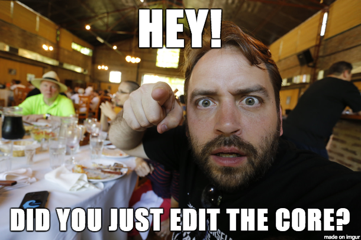
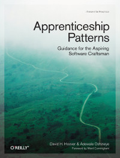
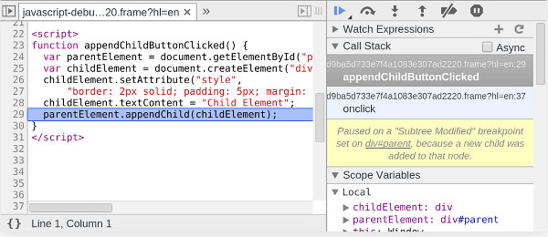
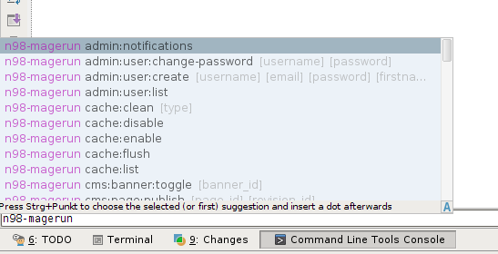

class: center, middle, full-background
background-image: url(img/outils.png)

#Les 42 protips du développeur


.bottom.center[**MageConf 2014**]

.bottom.center[<em>Pierre Martin - @pierremartin</em>]

???

42 astuces en 5 minutes, soit 300 secondes ... cela fait 7 secondes par astuce

... et j'ai perdu du temps

---

class: full-background
background-image: url(img/coffee.png)
layout:true

# Magento

---

---

.protip[1] Jouez à Cache-cache

```
class Mage_Catalog_Model_Product extends Mage_Catalog_Model_Abstract
{
	// ...
*	const CACHE_TAG              = 'catalog_product';
	// ...
}
```

```
class {NS}_{Module}_Block_{View} extends Mage_Core_Block_Template {
    protected function _construct()
    {
        $this->addData([
            'cache_lifetime'    => 120,
            'cache_tags'        => [
*            	Mage_Catalog_Model_Product::CACHE_TAG,
            	$this->getProduct()->getId()
            ],
*            'cache_key'          => $this->getProduct()->getId(),
        ]);
    }
}
```

---

.center[.protip[2]  Pas touche au coeur !

]

---

.protip[3] \*.p**HTML** + Blocks, Helpers

--

.protip[4] Déclenchez des évènements métier !

```
Mage::dispatchEvent(
	'checkout_cart_product_add_after',
	array('quote_item' => $result, 'product' => $product)
);
```

???

Open Closed Principle

--

.protip[5] ~~Rewrites~~ vs **Observers**

--

.protip[6] Relire régulièrement :

* https://magentotherightway.com/
* http://magecert.com/

---

.protip[7] Logguez **TOUT**

--

.protip[8] `Varien_Object::debug()`

.protip[9] `$collection->printLogQuery(true)`


---

class: full-background
background-image: url(img/coffee.png)
layout:true


---

---

.protip[10] Revue de code avant utilisation (cf .protip-reference[1] -> .protip-reference[9])

--

.center[]

--

.protip[11] Quelques bons modules

* AoeScheduler
* OwebiaShipping2
* Flagbit Magento-ChangeAttributeSet
* Fooman GoogleAnalytics Plus
* Dev Toolbar (`kirchbergerknorr/magento-debug`)

???

* MageMonkey (Mandrill / Mailchimp)
* Extended Product Grid with Editor

---

class: full-background
background-image: url(img/developpeur.png)
layout:true

# Développeur avant tout

---

---

.protip[12] Café

--

.protip[13] Avoir du bon matériel : SSD, multi-écrans

--

.center[]

???

	Votre environnement de travail est avec votre lit l'endroit où vous passez la majorité de votre temps.
	Vous ne dormez pas sur un matelas de camping, alors investissez dans vos outils

---

.protip[14] Zsh / OhMyZsh, Fish ...

--

.protip[15] `rupa/z`

--

.protip[16] Patatez !


???

Rien de mieux qu'une feuille et un crayon ou un tableau blanc pour poser ses idées

---

.protip[17] Lisez les bibles techniques

.center[
	
	
	
	
]

---

.protip[18] ... et sur notre métier

.center[
	
	
	
]

---

.protip[19] Versionnez votre code (Git)

--

.protip[20] Commits unitaires + `git-bisect` = 

--

.protip[21] tig, gitk, sourcetree

???

soyez aussi à l'aise dans l'état de votre projet (branche courante, dépôt distant, état en cours) que dans la navigation de vos fichiers

--

.protip[22] gti

.center[]

---

.protip[23] Faites des pauses *(café)*

--

.protip[24] Automate all the things!

.center[]

.center.no-bullets[
* Fabric / Capistrano
* Gulp / Grunt
* Makefile
]

---

class: full-background
background-image: url(img/rame.png)
layout:true

.center[]

---

---

.protip[25] Xdebug

* Erreurs
* Débuggueur
* Xdebug : profiling (ou XHProf)

???

	die('toto'); tue

	"Ce qui ne se mesure pas ne s'améliore pas" une optimisation se fait à base de chiffres, pas au hasard

--

.protip[26] Parlez à un canard

---

.protip[27] Composer

--

.center.warning[/!\ versions sur packages.firegento.com /!\]

--

.protip[28] Cache d'opcode : OPcache (5.5+), APC (5.5-)

--

.protip[29] Testez !

`EcomDev_PHPUnit`, Behat, PHPSpec, Codeception

---

class: full-background
background-image: url(img/colored-houses.png)
layout:true

# Du Front aussi

---

---

.protip[31] BEM + préprocesseurs = CSS SOLID

--

.protip[32] Concaténation des assets + cache busting (`all.js?42569`)

.center[`jreinke/magento-suffix-static-files`]

--

.protip[33] http://re-view.emmet.io/

---

.protip[34] DevTools FTW

* http://devtoolsecrets.com/
* http://discover-devtools.codeschool.com/

.center[]

---

class: full-background
background-image: url(img/coffee.png)
layout:true

# (re)Magento

---

.protip[35] Utilisez un vrai IDE

--

<span style="float:right"></span>
Pour noël : .blink[offrez **Magicento** à un dév]

--

.protip[36] n98-magerun




---

.protip[37] Modman

--

.protip[38] `<update handle="foo_bar" />`

```
<handle_de_ma_nouvelle_page>
    <update handle="customer_account" />
</handle_de_ma_nouvelle_page>
```

---

class: full-background
background-image: url(img/mac-glasses.png)
layout:true

# Veillez

---

.protip[39] Faites de la veille

<small>*http://magenticians.com/, Twitter, PHP Weekly, JS Weekly, Docker Weekly, Arnold & Weekly*</small>

--

.protip[40] Continuez d'apprendre : Coursera, edX

*University of California, San Diego*

> **Human-Computer Interaction Design**
>
> Helping you build human-centered design skills, so that you have the principles and methods to create excellent interfaces with any technology.

<small>https://www.coursera.org/course/hcidesign</small>

---

.protip[41] Meetups locaux


.center[
##### Connaissez-les
]
--
.center[##### Participez]
--
.center[#### Partagez]
--
.center[### Organisez]
--
.center[## Adhérez à OpenGento !!]

--

.center.blink[... et remerciez ceux qui ont rendu possible la Mageconf]

---

layout:false
class: center, middle, full-background
background-image: url(img/have-fun.png)

# .protip[42] Mais surtout Faites vous plaisir !


<small>[http://real34.github.io/slides](http://real34.github.io/slides)</small>