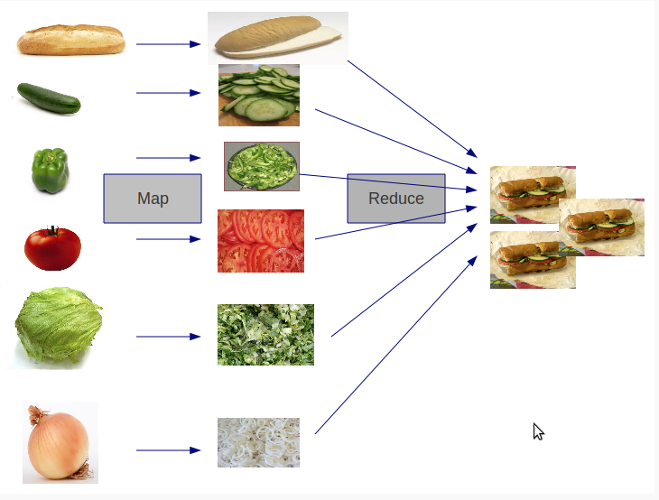

class: center, middle

# CakePHP 3

## Tour d'horizon


.bottom.center[<em>Pierre Martin - @pierremartin</em>]

---

# Pour qui ?

* ceux qui n'utilisent pas encore CakePHP
* les meilleurs qui codent déjà en 2.x

---

class: center, middle

# Pour ceux qui n'utilisent pas encore CakePHP

---

# Derniers outils PHP

* PHP 5.4.19+ (5.5+ en 3.x)
--


* PSRs (0, 1, 4 ... et des tabulations !)
--


* Composer (`cakephp/app`, `cakephp/plugin-installer`)
--


* PHPUnit pur
--


* Carbon, Aura Intl, password_compat

???

* A permis de refactorer le coeur en extrayant de nombreux Traits pour les fonctionnalités classiques (Configuration, Logs, Collections ...)

---

# ADN préservé

* Conventions over configuration
--


* Documentation dans la *définition de fini*
--


* Communautaire

---

class: center, middle

# Pour les utilisateurs actuels de CakePHP

---

# Moins de magie

* Namespaces

* Traits

* Exemple : `TimestampBehavior`

* Configuration simplifiée : `app.php`

* Remise à plat du `Router` (O(1) au lieu de O(n) - paramètres nommés)

---

# Moins de code

## Bye bye

* ACL
* Scaffolding
* Containable
* Authorizers

--

## Plugins

* FriendsOfCake/crud
* cakephp/acl (Phinx)
* ACL

---

layout:true

# ORM

---

.center[]

---

* Modèles = `Entity` + `Table`

* Custom finds prépondérants (diviser pour reigner)

* Lazy loading

* Adieu les `'recursive' => 0` et le `ContainableBehavior`

* Plus de `afterFind()` ni de `virtualFields`

---

layout:false

class: center, middle

# DU CODE !!!

---

layout:true

# View Cells

---

```
namespace App\View\Cell;
use Cake\View\Cell;

class InboxCell extends Cell {

    public function display() {
        $this->loadModel('Messages');
        $unread = $this->Messages->find('unread');
        $this->set('unread_count', $unread->count());
    }

}
```

---

```
<div class="notification-icon">
    You have <?= $unread_count ?> unread messages.
</div>
```

```
// Load an application cell
$cell = $this->cell('Inbox');

// Load a plugin cell
$cell = $this->cell('Messaging.Inbox');

// Run the recent() method on the Inbox cell with params
$cell = $this->cell('Inbox::recent', ['since' => '-3 days']);
```

---

layout:false

# Give me a ...

```
<?php
namespace App\Controller;
use App\Controller\AppController;

class ProjectsController extends AppController {

  // CRUD!

}
```

---

# C

```
  public function add() {
    $project = $this->Projects->newEntity($this->request->data);

    if ($this->request->is('post')) {
      if ($this->Projects->save($project)) {
        $this->Flash->success('The project has been saved.');
        return $this->redirect(['action' => 'index']);
      } else {
        $this->Flash->error('The project could not be saved. Please, try again.');
      }
    }

    $this->set(compact('project'));
  }

```

---

# R

```
  public function index() {
    $this->set('projects', $this->paginate($this->Projects));
  }

/**
 * @throws \Cake\Network\Exception\NotFoundException
 */
  public function view($id = null) {
    $project = $this->Projects->get($id, [
      'contain' => ['Tasks', 'ClosedTasks']
    ]);
    $this->set('project', $project);
  }
```

---

# U

```
  public function edit($id = null) {
    $project = $this->Projects->get($id, [
      'contain' => []
    ]);

    if ($this->request->is(['patch', 'post', 'put'])) {
      $project = $this->Projects->patchEntity($project, $this->request->data);
      if ($this->Projects->save($project)) {
        $this->Flash->success('The project has been saved.');
        return $this->redirect(['action' => 'index']);
      } else {
        $this->Flash->error('The project could not be saved. Please, try again.');
      }
    }

    $this->set(compact('project'));
  }
```

---

# D

```
  public function delete($id = null) {
    $project = $this->Projects->get($id);

    $this->request->allowMethod('post', 'delete');
    if ($this->Projects->delete($project)) {
      $this->Flash->success('The project has been deleted.');
    } else {
      $this->Flash->error('The project could not be deleted. Please, try again.');
    }

    return $this->redirect(['action' => 'index']);
  }
```

---

# Entities

```
<?= $this->Html->link($article->title, $article->permalink); ?>
```

```
namespace App\Model\Entity;
use Cake\ORM\Entity;

class Article extends Entity {
    protected $_accessible = [
        'title' => true,
        'body' => true,
        '*' => false,
    ];

    protected function _getTitle($title) {
      return ucwords($title);
    }

    protected function _setTitle($title) {
        $this->set('slug', Inflector::slug($title));
        return $title;
    }

    protected function _getPermalink($title) {
      return ['controller' => 'Articles', 'action' => 'view', $this->_properties['slug']];
    }
}
```

---

# Tables

```
<?php
namespace App\Model\Table;

use Cake\ORM\Query;
use Cake\ORM\Table;
use Cake\Validation\Validator;

class CitiesTable extends Table {

  public function initialize(array $config) {
    $this->table('cities');
    $this->displayField('name');
    $this->primaryKey('id');

    $this->belongsTo('Countries', [
      'foreignKey' => 'country_id',
    ]);

    $this->addBehavior('Timestamp');

    // $this->entityClass('App\Model\Ville');
  }

}
```

---

# HABTM

```
class StudentsTable extends Table {
    public function initialize(array $config) {
        $this->belongsToMany('Courses', [
            'through' => 'CourseMemberships',
        ]);
    }
}

class CoursesTable extends Table {
    public function initialize(array $config) {
        $this->belongsToMany('Students', [
            'through' => 'CourseMemberships',
        ]);
    }
}

class CoursesMembershipsTable extends Table {
    public function initialize(array $config) {
        $this->belongsTo('Students');
        $this->belongsTo('Courses');
    }
}
```

---

# Validation

```
namespace App\Model\Table;

use Cake\ORM\Table;
use Cake\Validation\Validator;

class ArticlesTable extends Table {
    public function initialize(array $config) {
        $this->addBehavior('Timestamp');
    }

    public function validationDefault(Validator $validator) {
        $validator
            ->notEmpty('title')
            ->notEmpty('body');

        return $validator;
    }
}
```

---

# Routing

```
Router::scope('/', function($routes) {
    $routes->connect('/:controller', ['action' => 'index']);
    $routes->connect('/:controller/:action/*');
});
```

```
Router::prefix('admin', function($routes) {
    $routes->connect('/:controller', ['action' => 'index']);
    $routes->connect('/:controller/:action/*');
});

// $this->Html->url(['controller' => 'users', 'action' => 'delete', 42, 'prefix' => 'admin'])
```

```
// Connect a route with a name.
$routes->connect(
    '/login',
    ['controller' => 'Users', 'action' => 'login'],
    ['_name' => 'login']
);

// Generate a URL using a named route.
$url = Router::url(['_name' => 'login']);
```

---

# Collections

... tu vois underscorejs ? Ben pareil !

```
$cakephpTweets = new Collection($tweets);
$myTimeline = $cakephpTweets->append($phpTweets);

// Tweets containing cakefest from both sources
$myTimeline->filter(function($tweet) {
    return strpos($tweet, 'cakefest');
});
```

(`every`, `each`, `combine`, `firstMatch`) ...

[https://github.com/cakephp/collection]()

---

layout:true

# ORM

---

## Philosophie

"Toute requête doit pouvoir être faite en quelques lignes simplement"

- José Lorenzo Rodriguez

---

## Finders everywhere!

```
  public function findBiggestMonarchies(Query $query) {
    return $query
      ->where(['government_form LIKE' => '%Monarchy%'])
      ->order(['population' => 'DESC']);
  }

  public function findRepublics(Query $query) {
    return $query
      ->where(['government_form' => 'Republic'])
      ->orWhere(['government_form' => 'Federal Republic']);
  }
```

```
TableRegistry::get('Cities')->find('republics');
```

---

## Sous-requêtes et fonctions SQL

```
  public function findAverageLifeExpectancy(Query $query) {
    return $query->select(['average_exp' => $query->func()->avg('life_expectancy')]);
  }

  public function findWithHighLifeExp(Query $query) {
    $average = $this->find('averageLifeExpectancy');
    return $query
      ->where(['life_expectancy >' => $average])
      ->order(['life_expectancy' => 'DESC']);
  }
```

---

layout:true

# "Je veux les pays contenant des villes dont la population est plus grande que le Danemark"

---

## - Un client

.center[]

---

```
public function findWithCitiesBiggerThanDenmark(Query $query) {
  $denmarkPopulation = $this->find()
    ->select(['population'])
    ->where(['id' => 'DNK']);

  return $query
    //->distinct(['Countries.id'])
    ->matching('Cities', function($q) use ($denmarkPopulation) {
      return $q->where(['Cities.population >' => $denmarkPopulation]);
    });
}
```
---

layout:false

## plus besoin de `afterFind()` :

`formatResults()` chainables

```
$query->formatResults(function($results) {
  return $results->groupBy('foo');
  // ou $results->combine('id', 'name');
});
```

```
$query->formatResults(function($results, $query) {
    return $results->map(function($row) {
        $row['age'] = $row['birth_date']->diff(new \DateTime)->y;
        return $row;
    });
});
```

---

.center[]

---

## Implémentation

* Stratégies d'association : `$this->Languages->strategy('subquery')` (ou 'inner', ou 'left')
* `bufferResults(false)` pour une utilisation constante de mémoire (ne charge pas tout)

```
use Cake\ORM\TableRegistry;

// Now an instance of ArticlesTable.
$articles = TableRegistry::get('Articles');
$query = $articles->find();

foreach ($query as $row) {
    // Each row is now an instance of our Article class.
    echo $row->title;
}
```

---

## En savoir plus

.... http://github.com/lorenzo/cakephp3-examples

---

class:center, middle

# Ça c'est fait !

[http://real34.github.io/slides](http://real34.github.io/slides)


