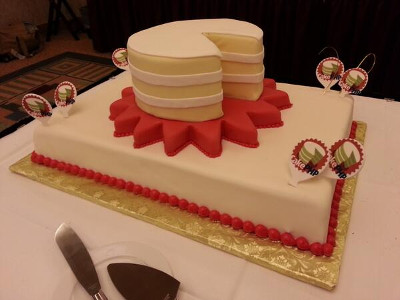
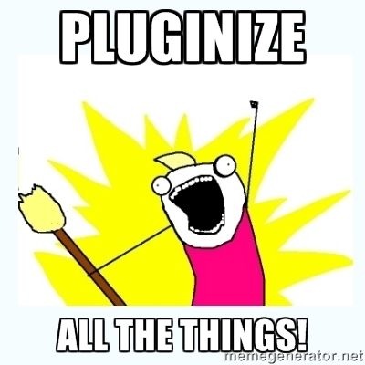
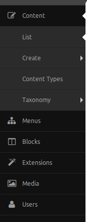
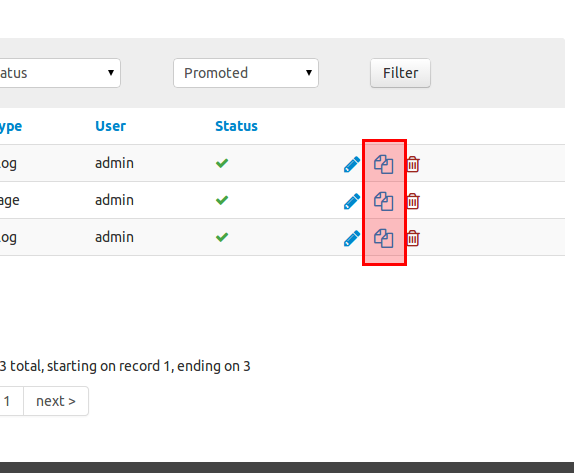
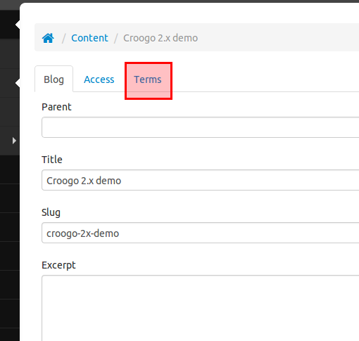
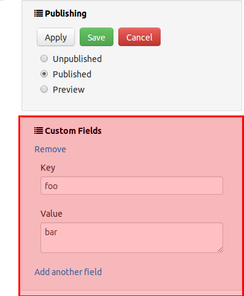
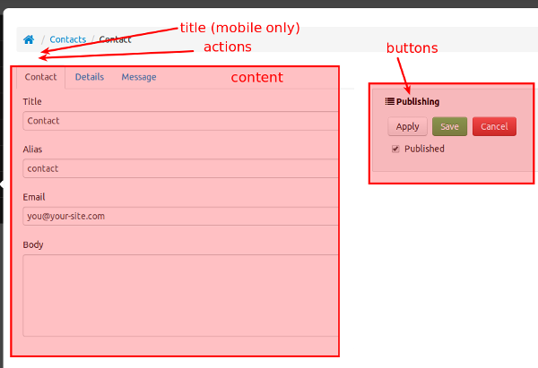
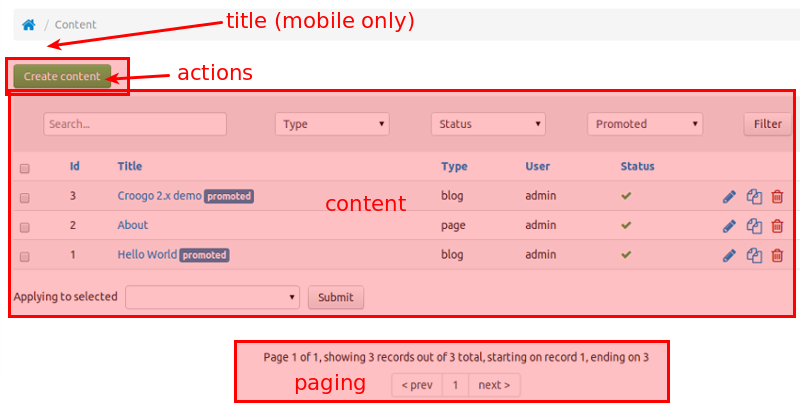

class: center, middle

# Croogo for business applications



.bottom.center[<em>Pierre Martin - @pierremartin</em>]
.bottom.center[<em>CakeFest 2014 - Madrid</em>]

???

Hi, I'm Pierre!

This talk's main goal is to provide you a different perspective of an open source CakePHP CMS you
might already know.

I will try to illustrate how you can use Croogo as a foundation of a business application
and stop worrying about developing the same features again and again.

---

class:full-background
background-image: url(img/croogo_github.png)

???

The Croogo project has been started / open sourced in October 2009 by Fahad Ibnay Heylaal
based on CakePHP 1.2.5 at the time.
It is now compatible with the latest CakePHP stable version and has received lots of contributions since its release.

It is used as a CMS on many websites, and we are using it as starting point for projects at Occitech
when we have to create custom applications for our clients

In the room, who:
* knew Croogo?
* used Croogo?
* uses Croogo?

---

# Our reasons

.center[]

???

* A few years ago we started to discuss with my team about ways we could leverage our experience and code
to focus more on our clients specific logic and start reusing more our Plugins.

As an agency we had several projects a year, and we wanted to be more efficient when bootstraping a new project.

Here is what we were looking for at that time

--

* increase code reuse

???

* Over the years we detected that we often had duplicated code across projects, without really leveraging this experience.

--

* the "no solid User management plugin" syndrom

???

* We felt like a waste of time to always work on technical features not much related to the domain of our clients (password forgotten, content management, email management ...).

But were in a situation where we had never taken the time to leverage our experience and build a good basis of reusable plugins

--

* spread improvements across all clients

???

* Continuous improvement is at the core of our team.

We learn a lot, and adopt better practices often. It was thus frustrating to not being able to easily reuse what we learned project A for the next iteration of project B.

--

* technologies: Composer, Twitter bootstrap

???

* We felt like we were missing the new tools that could make our lives easier and wanted to adopt them more

--

* UI / UX homogeneity

???

* Finally, we wanted to have a better homogeneity in our admin interfaces

**For all these reasons we considered building our own core to be reused across projects**
... and then we found

---

# THE roadmap
## Croogo 1.5 / 2.0

--

* Admin theme (Twitter Bootstrap)
* Migration plugin (cakedc)
* Pluginify
* Helpers to create UI components markups, eg: tabs, accordion, panels.
* Composer

???

Pluginify: first a few plugins and then the whole core

Technical debt, but we felt it was faster (and more useful for others) to contribute back instead of creating yet another project

--

.center[]

???

**So we decided to use Croogo for our next projects and contribute to the effort when possible**

Everything you see here is now in Croogo since a few releases

---

# Are you asleep?

.center[]

???

Please stand up and applause for the organizer of the event, it was an amazing CakeFest.

Thanks James and all the crew!

---

class:center

# Croogo is a CMS

.no-bullets[
* http://demo.croogo.org/2.0/
* http://demo.croogo.org/2.0/admin
* `composer create-project croogo/app`
]

???

I won't go over all Croogo features. Consider it has most of the feature a simple CMS must have:

* User management,
* pages,
* categories (Taxonomies),
* Settings
* ACL
* Extensions and Themes lifecycle

What I mentioned earlier about our needs at Occitech is also here now in Croogo!

--

... but do not use it

???

But in my opinion you must not be using it as a "stable" tool for your CMS projects

--

**for Content Management only**

???

If you just need a CMS use something like Wordpress or Ghost,
However for applications that have basic CMS features Croogo is a good starting point.

You must consider it as your internal tool, and learn how it works internally... it is just CakePHP code anyway!

The talk will now show how you could building your application on top of Croogo.

---

class: middle, center



???

The first practice to promote is trying to keep everything in its own plugin and separate explicitely responsibilities.

Reduce (or if possible avoid) coupling to the minimum needed.

Examples: Invoice, Teams, Catalog, Payment, Pricing, Notifications...

You will see that Croogo helps you to make interactions between plugins much more easily without introducing hard dependencies.

BTW, I recommend importing Croogo as a Composer dependency so what you version is really some domain specific logic.
After a few projects you may be able (I guess) to extract plugins developed in Project A as dependency and reuse it for another need.

**So let's see how a Croogo plugin looks**

---

# A Croogo Plugin

```
Example
│
├── Config
*│   ├── Migration
*│   ├── plugin.json
│   ├── bootstrap.php
*│   ├── events.php
*│   ├── ExampleActivation.php
│   └── routes.php
│
├── Event
│   └── ExampleEventHandler.php
│
├── View
*│   ├── Elements
│   │   └── admin_tab_node.ctp
│
├── Controller
├── Model
└── webroot

```

???

This is a classic CakePHP plugin, with a few specific magic files

---

layout:true

# Plugin activation

---


???

As I said earlier, Croogo will handle Plugin lifecycle for you.

When a plugin is installed and enabled you do not have to manually loading it in the application. Croogo will initialize everything for you.

Croogo provides a way to execute logic when your Plugin is activated or deactivated, let's see how

---

`Plugin/Example/Config/ExampleActivation.php`
```
class ExampleActivation {

  public function beforeActivation(ExtensionsPluginsController $controller) {
    // [...]
    return $canBeActivated;
  }

  public function onActivation(ExtensionsPluginsController $controller) {
    // [...]
  }

  public function beforeDeactivation(ExtensionsPluginsController $controller) {
    // [...]
    return $canBeDeactivated;
  }

  public function onDeactivation(ExtensionsPluginsController $controller) {
    // [...]
  }

}
```

???

If your Plugin has an Activation class, its callbacks will be called so you could run any arbitrary logic.

For instance **check that preconditions are met for activation / deactivation.**

The Controller is passed to the callbacks (I know it could be better), so you can access to useful methods

You can also initialize models and call their methods

---

* `CroogoPlugin::migrate() / unmigrate()`

* Create ACO / ARO

* Model methods (ex: add links to a public menu)

???

Here is a list of tasks that are usually achieved here

---

layout:true

# Events handlers

---


???

Avoid "events spaghetti"!
One place to declare **EXPLICITELY** which events trigger changes in this Plugin.

Prevent common errors due to lazy loading

Makes Event handling logic easier to test

---

```
Plugin/Notifications
├── Config
*│   ├── events.php
│   ├── NotificationActivation.php
│   └── plugin.json
├── Event
*│   └── EmailsEventHandler.php
├── Test
└── View
    └── Emails
        ├── html
*        │   ├── user_activated.ctp
        │   ├── user_refused.ctp
        └── text
            ├── user_activated.ctp
            ├── user_refused.ctp

```

---

`Config/events.php`
```
<?php
$config = array(
  'EventHandlers' => array(
    'Notifications.EmailsEventHandler'
  ),
);
```

???

Croogo will detect if the plugin has a `events.php` file and load the event configuration and register the EventHandlers for you when needed

You are thus sure that ALL your listeners will be attached

---

```
<?php
App::uses('CakeEmail', 'Network/Email');

class EmailsEventHandler extends Object implements CakeEventListener {

  public function __construct(CakeEmail $Email = null, $emailConfig = 'default') {
    // [...]
  }

  public function implementedEvents() {
    return array(
      'ACME.Model.User.Refused' => array('callable' => 'onUserRefused'),
      'ACME.Model.User.Activated' => array('callable' => 'onUserActivated'),
    );
  }

  public function onUserRefused(CakeEvent $event) {
    // [...]
  }

  public function onUserActivated(CakeEvent $event) {
    // [...]
  }

}

```

---

layout:true

# Hooks

???

TODO Rephrase
Transition du "tu te hook par évènement ou sur du code existant qui n'a pas d'evenements"

---

Usually in `bootstrap.php`

--

```
Croogo::hookComponent($controllerName, $componentName)
Croogo::hookBehavior($modelName, $behaviorName, $config = array())
Croogo::hookHelper($controllerName, $helperName)
```

--

```
Croogo::hookModelProperty($modelName, $property, $value)
Croogo::hookControllerProperty($controllerName, $property, $value)
```

???

Usually placed in the bootstrap.php
You can hook things to a lot of things.

It is useful to setup Translations for instance, or bind a Profile to Users for instance

All of these examples were for technical interactions but Croogo offers more than that. You can also add content at several places in the admin area. Here is how.

---

```
CroogoNav::add($menu, $path, $options = array());
```

.left_col[]

--

.right_col[

```
array(
  'title' => 'Example',
  'url' => '#',
  'icon' => array('credit-card', 'large'),
  'weight' => 6
  'children' => array(
    'example1' => array(
      'title' => 'Example 1',
      'url' => array(/*[...]*/),
    ),
    'example2' => array(
      // [...]
      'children' => array(
        'example-2-1' => array(/*[...]*/),
      ),
    ),
  ),
));
```
]

???

You can add CSS classes and even more to ensure a pretty fair customization

---

```
Croogo::hookAdminRowAction($action, $title, $url)
```

.center[]

---

```
Croogo::hookAdminTab($action, $title, $element, $options = array())
```

.center[]

---

```
Croogo::hookAdminBox($action, $title, $element, $options = array())
```

.center[]

---

layout:true

# View Blocks (Admin Forms)

---

`Croogo/View/Common/admin_edit.ctp`
```html
<h2 class="hidden-desktop">
<?php
*  if ($titleBlock = $this->fetch('title')):
    echo $titleBlock;
  else:
    echo !empty($title_for_layout) ? $title_for_layout : $what . ' ' . $modelClass;
  endif;
?>
</h2>
```

--

`Payments/View/Payment/admin_add.ctp`
```
$this->extend('Common/admin_edit');

*$this->assign('title', '&#9835; Money money money &#9835;');

$this->Html
  ->addCrumb('', '/admin', array('icon' => 'home'))
  ->addCrumb(__d('payments', 'Payments'), array('action' => 'index'))
  ->addCrumb($this->get('title_for_layout'));

```

???

Croogo leverages view inheritance and View Blocks to allow you to quickly get a form / list view in place.

Since it extends core helpers with convenience methods for Twitter Bootstrap styling, it is easier to have a better homogeneity

---

.center[]

---

layout:false

# View Blocks (Admin Lists)

.center[]

???

Similar to what is allowed by the `admin_edit` view, you can fully customize the list view

---

# Simple CRUD

`Croogo/View/Common` + helpers

Initial and quick prototyping

* `$displayFields`

--

* `$searchFields`

--

* `$editFields`

---

layout:false

# But it is not perfect!
--

* Small community

???

There are not many contributors to Croogo, and its ecosystem
Which means there are not many plugins or themes up-to-date yet

--

* Code over Documentation

???

* Very light documentation, not up-to-date
but awesome help if you really have a good problem: irc, google group

--

* Technical debt (1 men project)

???

* Sometimes you will have some refactorings to do in the core (and contribute) so you could implement features you want.

Scrutinizer was setup so you could easily get an overview.
Feel free to help!

--

* You'll find bugs

???

* When doing the adventurer deep inside the core.
Don't be ashamed and issue a PR, it will be treated quite quickly

---

# Towards 3.0

* CakePHP 3
* Refactorings / Rewrites (Controllers ...)
* Twitter Bootstrap 3

.center[]

???

The main goal of the 3.0 version is to Cake3 compatibility
This is a **huge work** that has just been started

Rewriting the current codebase to use Entities and Tables will give the opportunity
to also spend some time on code refactoring -> Controllers slim fast!

There are also many other Cake3 improvements that could be leveraged to simplify codebase:
* templates
* events
* routing

As always there is also more decoupling to be done between core Plugins

I do not know if our team will have the opportunity to help much, since it depends on client
projects we will have, but maybe your team can share the same conclusion than ours and
you will use Croogo as a basis for your next business applications!

---

class:center, middle

# Thank you!

https://joind.in/11605

[http://real34.github.io/slides](http://real34.github.io/slides)


