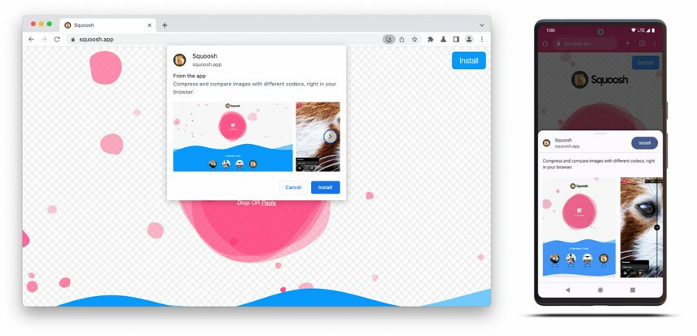

# PWA

Du web pour faire des applications mobiles ?

##### 24/11/2023 - _Pierre MARTIN_


---

# Une application mobile ?

<!-- prettier-ignore -->
* Une application mobile est une application qui s'exécute sur un appareil mobile (LLM™)
* Facile d'accès (icône)
* Pas de *navigateur* (barre d'adresse…)
* Plein écran
* Fonctionne hors ligne (partiellement)
* Notifications
* Accès aux fonctionnalités de l'appareil (appareil photo, géolocalisation…)
* Contient des boutons pour naviguer, swiper, scroller…

---

# Exemples

<!-- prettier-ignore -->
* Réseaux sociaux
* Jeux
* Email
* Agenda
* Actualités
* Banque
* Cartes et GPS
* Annonces / E-commerce


---

# Un site web ?

<!-- prettier-ignore -->
* Un site web est une application qui s'exécute dans un navigateur (LLM™)
* Accesible via une URL
* Hébergé sur un serveur web
* Trouvable via un moteur de recherche
* Compatible avec toutes les tailles d'écran (responsive)
* Contient des liens pour naviguer

---

# Exemples

<!-- prettier-ignore -->
* Réseaux sociaux
* Jeux
* Email
* Agenda
* Actualités
* Banque
* Cartes
* Annonces / E-commerce


---


---

# PWA

## Progressive

Fonctionne pour tout le monde, quel que soit navigateur (cœur).\
**Amélioration progressive** quand c'est possible.

## Web

Trouvable et accessible via une URL.\
Utilise les standards du web (W3C).

## App

💫 📲

<!-- TODO Image web to PWA -->

---

<!-- header: PWA > App -->
<!-- class: invert -->

## _Capable_

APIs Web : géolocalisation, appareil photo, …\
WebRTC, WebGL, WebVR, WebAssembly (C++, Rust…)

## _Reliable_

Fiable et rapide, peu importe la qualité du réseau.\
Gestion des transitions (UI feedback) et erreurs.

## _Installable_

Intégrée au système d'exploitation.\
Lançable, persistante, notifications, partage, application par défaut.

---

<!-- header: "" -->
<!-- class: default -->

# Et niveau code, ça donne quoi ?

<!-- prettier-ignore -->
* HTML, CSS, JS, en ligne … ça part de là ! *\**
* Responsive, mobile first (sinon ça va être compliqué)
* Un **manifeste** (JSON) pour décrire l'application
* Un **service worker** pour gérer les mises en cache et les notifications
* Plein d'**Améliorations progressives** (*feature detection* d'APIs Web)
* De l'UI, de l'UX, des itérations encore et encore…

_\* c'est ici que vous pouvez réutiliser tout l'écosystème web : Vue, React, Sass, PHP…_

---

# Manifest



---

<!-- header: "Manifest" -->

Habituellement `/manifest.json` ou `/manifest.webmanifest`

```html
<link rel="manifest" href="/manifest.json" />
<link rel="manifest" href="/manifest.json" crossorigin="use-credentials" />
```

---

```json
{
  "name": "HackerWeb",
  "short_name": "HackerWeb",
  "start_url": ".",
  "display": "standalone",
  "background_color": "#fff",
  "description": "A readable Hacker News app.",
  "icons": [
    {
      "src": "images/touch/homescreen48.png",
      "sizes": "48x48",
      "type": "image/png"
    },
    {
      "src": "images/touch/homescreen72.png",
      "sizes": "72x72",
      "type": "image/png"
    }
    // …
  ],
  "related_applications": [
    {
      "platform": "play",
      "url": "https://play.google.com/store/apps/details?id=cheeaun.hackerweb"
    }
  ]
}
```

[MDN - Web app manifests](https://developer.mozilla.org/en-US/docs/Web/Manifest) 💡 Matrice de compatibilité

---

## Quelques exemples en vrai

DevTools: `Application > Manifest`

- https://twitter.com/manifest.json
- https://mail.google.com/mail/manifest.json
- https://www.lequipe.fr/_nuxt/manifest.json
- https://open.spotifycdn.com/cdn/generated/manifest-web-player.1609946b.json

🔖 Des outils pour aider à la génération. Ex : https://www.pwabuilder.com/

---

# Service worker

[](https://web.dev/learn/pwa/service-workers?hl=fr)

---

<!-- header: "Service worker" -->

## Accès hors ligne et notifications push

- préchargement des ressources
- app-shell
- cache dynamique

## Synchronisation en arrière-plan

## Contrôle des requêtes

> _« Ça va couper chérie ! »_

- utilisation du cache (différentes stratégies) pour un chargement rapide
- un contrôle total sur les requêtes de navigation et de ressources

---

## Enregistrement

```js
if ("serviceWorker" in navigator) {
  navigator.serviceWorker.register("/serviceworker.js");
}
```

[Demo](https://web.dev/learn/pwa/service-workers?hl=fr) + DevTools: `Application > Service Workers`

---


---

## Utilisation

À la main (simple) ou (cas complexes) avec une librairie comme [Workbox](https://developers.google.com/web/tools/workbox)

[](https://developers.google.com/web/tools/workbox)

---

<!-- header: "" -->

# Les APIs Web

> _Pour tout le reste, on a le Web_

- Parfois expérimentales
- Parfois stables
- Durables
- **Amélioration progressive**


---

# Que sait faire le web **aujourd'hui** ?

- https://caniuse.com/background-sync
- https://whatwebcando.today/
- https://whatpwacando.today/

---

<!-- class: invert -->

# À vous de tester maintenant !

## 🔖 https://real34.github.io/slides/

- 🌍 https://www.pierre-martin.fr/
- 🐦 [@pierremartin](https://twitter.com/pierremartin)
- 🦣 [@pierre@toot.cafe](https://toot.cafe/@pierre)
- 🍻 Toulouse (Frouzins)
