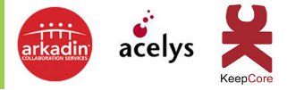
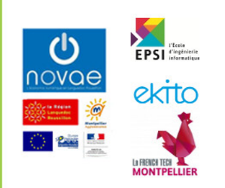
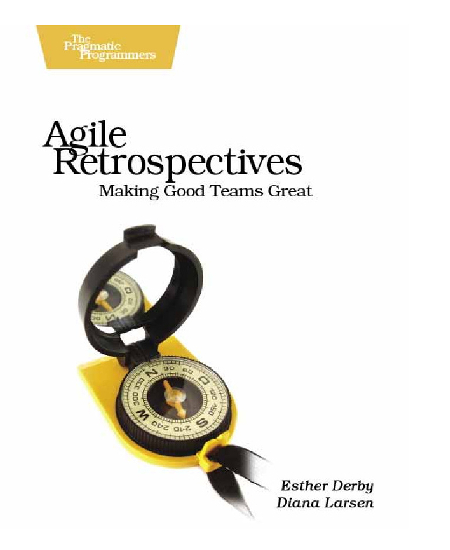
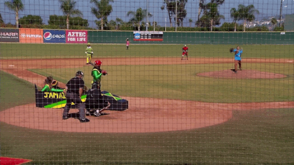
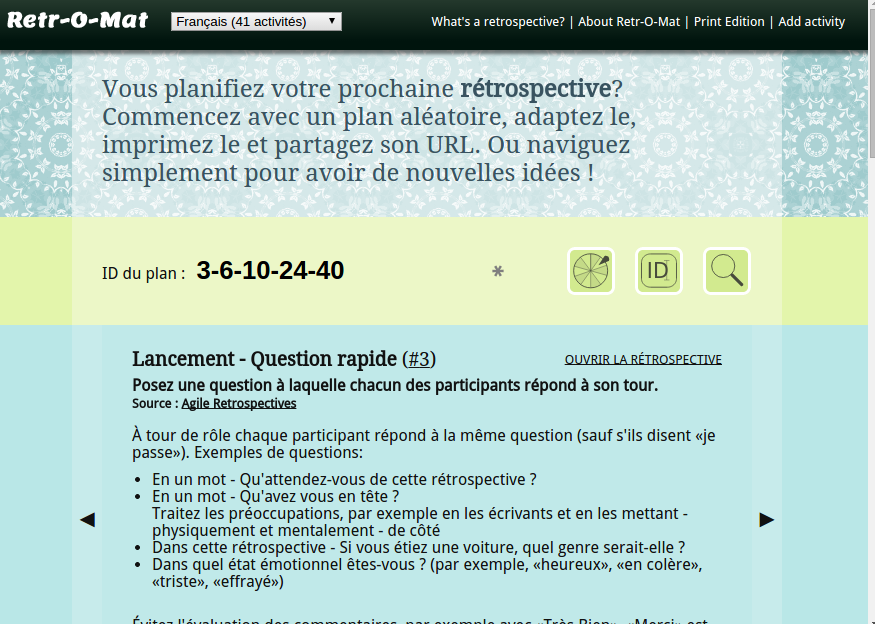

class: center, middle, no-footer

# Rétrospectives .pour-les-nuls[pour les nuls]

## 18 mois après ...

.bottom.center[<em>Pierre Martin - @pierremartin</em>]

---

class:no-footer

# Merci aux sponsors

.sponsor[## Platinum

]

.sponsor[## Gold

]

.sponsor[## Silver

]

.sponsor[## Institutionnels

]

---

# Notre retour d'expérience

.center[]

* Service - Multi-projets / clients
* 3 personnes fin 2012
* 6 personnes aujourd'hui
* Ma vision de : Co-gérant / Lead Dev

---

layout:false
class: center,middle

# Qu'est-ce qu'une "rétro" ?

---

layout:true

# Qu'est-ce qu'une "rétro" ?

---

## But

--

.center[S'améliorer en Expérimentant]

---

## Pré-requis

--

* Compréhension de la démarche (But)
--

* **Invitation** plutôt que contrainte
--

* Liberté de parole
--

* Écoute

---

## Déroulement

--

1. Mise en place (But ?)
--

2. Récolter des données
--

3. Extraire des pistes (Pourquoi ?)
--

4. Choisir des actions
--

5. Clôre la rétrospective

---

layout: false
class: center

???

Un livre qui contient des conseils pour faciliter une rétrospective

Par exemple comment gérer des rétrospectives qui dégénèrent (bavardages ...)

Contient également des astuces pour "scaler" et l'adapter à votre équipe / organisation

---

layout:false
class: center,middle

# Concrètement

???

Quelques exemples de phrases et actions qui sont remontées au fil des rétros

---

layout: true

# Concrètement

---

> Je n'ai plus confiance dans la réalisation des tâches que je délègue.
>
> -- <cite>Lead Dev</cite>

--

.retro-action[Actions : aucune directement]

---

> On a encore pas mal de bugs qui passent en validation client.
>
> -- <cite>Commercial</cite>

--

.retro-action[Tests fonctionnels, gamification]

---

> Lorsque j'arrive je ne sais pas trop sur quoi me lancer.
> Je me sens un peu esseulé
>
> -- <cite>Nouveau développeur en alternance</cite>

--

.retro-action[Pair programming]

---

> C'est embêtant quand on est tous sur des projets différents.
>
> -- <cite>Tous</cite>

--

.retro-action[ProtectMan]

---

> Nos clients ne sont pas disponibles !
>
> -- <cite>"Chef de Projet"</cite>

--

.retro-action[Définition de "prêt" pour le début d'une itération]

---

> La semaine dernière le client X a rajouté 5 demandes dans l'itération en cours, ce qui a généré un décalage de planning.
>
> -- <cite>Développeur</cite>

--

.retro-action[Faire une rétro avec le client]

---

> Il serait bien de pouvoir partager de nos veilles tous ensembles.
> <small>*J'en ai discuté avec X et Y, et cela a changé beaucoup de choses dans leur équipe.*</small>
>
> -- <cite>Lead Dev</cite>

--

.retro-action[Ateliers du midi, puis présentations]

---

class:center,middle
layout: false

# Quelques Exercices

## ... que nous avons bien aimé

---

---

layout: true

# Quelques Exercices

---

## Speed boat / Sailboat [#19](http://www.plans-for-retrospectives.com/?id=19)

Un classique pour commencer

---

## Lean Coffee [#51](http://www.plans-for-retrospectives.com/?id=51)

Évite les discussions sans fin

---

## Brainwriting [#66](http://plans-for-retrospectives.com/?id=66)

Brainstorming d'idées

---

## Park Bench [#41](http://plans-for-retrospectives.com/?id=41)

Évite les monologues

---

## Speed dating [#26](http://plans-for-retrospectives.com/?id=26)

Tout le monde échange

---

## Constellation [#52](http://plans-for-retrospectives.com/?id=52)

Rapide, Dynamique

Pas de justification

---

## Open Item List [#24](http://www.plans-for-retrospectives.com/?id=24)

Engagement individuel

---

## Dot voting [#38](http://www.plans-for-retrospectives.com/?id=38)

... tellement utile

---

## Appréciations [#15](http://www.plans-for-retrospectives.com/?id=15)

... émotifs s'abstenir

---

layout: false
class:center,middle

# Quelques conseils

???

Avant de finir cette session, j'ai rassemblé quelques conseils qui me semblent important
ou qui en tout cas m'ont semblé utiles pour nous.

---

layout: true

# Quelques conseils

---

## La bonne fréquence

--

... et la bonne durée

---

## Faites émerger les idées / feedbacks

???

vs préparation

---

## Des actions SMART

--

* **S**pécifiques
* **M**esurables
* **A**tteignables
* **R**éalistes
* **T**emporellement définies

???

* Spécifique (anglais : Specific) : Il doit être Spécifique à un collaborateur et ne pas dépendre d'éléments dont il n'a pas la maîtrise.
* Mesurable (anglais : Measurable) : Il doit être Mesurable, les indicateurs chiffrés devant être incontestables et reconnus comme tels par le collaborateur.
* Atteignable (anglais : Achievable) : Il doit être acceptable et réalisable par le collaborateur et Accepté.
* Réaliste ou Réalisable (anglais : Realistic) : Il doit être Réalisable et ne reposer que sur la motivation du collaborateur ou être réajusté si le contexte change.
* Temporellement défini (anglais : Time-bound) :  Il doit être inscrit dans le Temps, avec une date de fin et éventuellement des points intermédiaires.

---

## Chacun facilite

---

## Variez les exercices

---

## Commencez !

... tout simplement !

--

Même (surtout) si tout va bien

---

layout:false
class:center, middle

# À vous de jouer !

[http://real34.github.io/slides](http://real34.github.io/slides)

