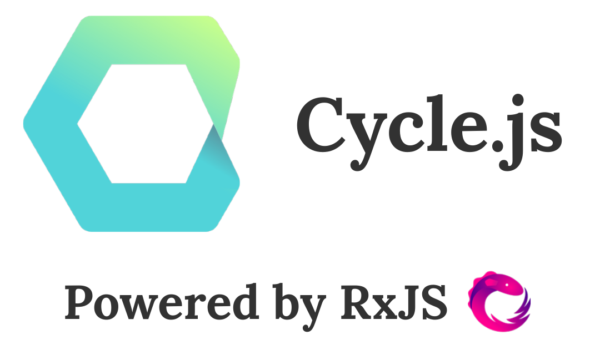

class: center, middle, full-background

#Et si l'utilisateur était une fonction ?

.center[**ToulouseJS #8**]

.center[<em>Pierre Martin - @pierremartin</em>]

???

Flux de données unidirectionnel, MV*, programmation réactive et fonctionnelle (+ Cycle.js ;))

---

#JavaScript en 2015

* ES2015
* Isomorphic / Universal
* Unidirectional dataflow
* Functional reactive programming
* Immutable data structures
* Flux
* Virtual DOM
* Declarative
* One-way data binding
* Dispatcher
* Cursors
* Shadow DOM
* Components
* State and props
* Purity
* BlablaJS

---

layout:true

# Une conversation :

---

--
**Alice :** Salut Bob !

--

**Alice :** Tu vas à ToulouseJS ?

--

**Bob :** Bien sûr il y a un truc sur jQuery

--

**Alice :** Ah super on se verra là-bas alors

--

**Bob :** kthxbye !

---

```text
Alice +--( A1 )--( A2 )----------( A3 )------------> (t)

Bob   +------------------( B1 )------------( B2 )--> (t)

```

???

* Alice : Salut Bob !
* Alice : Tu vas à ToulouseJS ?
* Bob : Bien sûr il y a un truc sur jQuery
* Alice : Ah super on se verra là-bas alors
* Bob : kthxbye !

--

```text

                 +-----------+
           +-----+   Alice   <-----+
           |     +-----------+     |
           |                       |
           |                       |
           v                       |
         Voix                    Ouïe
    +------------------------------------+
         Ouïe                    Voix
           +                       ^ 
           |                       |
           |                       |
           |      +---------+      |
           +------>   Bob   +------+
                  +---------+

```

???

Symétrie

---

layout:true

# Qu'est-ce qu'un REPL ?

---


--

> une discussion entre un utilisateur et une machine

--

```text

                 +-----------+
           +-----+   Alice   <-----+
           |     +-----------+     |
           |                       |
           |                       |
           v                       |
        clavier                  écran
    +------------------------------------+
         stdin                   stdout
           +                       ^ 
           |                       |
           |                       |
           |      +---------+      |
           +------>   REPL  +------+
                  +---------+

```

---

layout:false

# Une UI (web) est :

--

1 - un Cycle

--

2 - une fonction -> `Sortie = UI(Entrée)`

--

3 - asynchrone (*ex : autocomplete*)

--

4 - symétrique

--

.center[**... tout comme son utilisateur !**]

---

layout:true

# Et si l'utilisateur était une fonction ?

---

```
function User(/* ??? */) {
	/* ??? */ 
	return /* ??? */;
}

```

---

```
function User(/* ??? */) {
	/* ??? */ 
	return DOMEvent;
}

```

---

```
function User(/* ??? */) {
	/* ??? */ 
	return DOMEvent; // <-- DOMEvents ? [DOMEvent, DOMEvent, DOMEvent] ?
}

```

--

Asynchrone : notion de temps


```text
Alice +--( A1 )--( A2 )----------( A3 )------------> (t)
```

--

.center[**Flux d'évènements (EventStream)**]

---

layout:true

# Parenthèse : EventStream

---


**Tableau :** séquence dans l'espace.

```
[2, 4, 6]
	.filter(x => x < 5) // [2, 4]
	.map(x => x * 2) // [4, 8]
```

---

**EventStream :** séquence dans le temps.

```text
    +--( 2 )--( 4 )----------( 6 )------------> (t)
         |      |              |
         v      v              v
   +----------------------------------------------+
   |            .filter(x => x < 5)               |
   +----------------------------------------------+
         |      |              
         v      v              
    +--( 2 )--( 4 )---------------------------> (t)
         |      |              
         v      v              
   +----------------------------------------------+
   |             .map(x => x * 2)                 |
   +----------------------------------------------+
         |      |             
         v      v             
    +--( 4 )--( 8 )---------------------------> (t)


```

---

Exemple : Alice et Bob sur NRJ

```text

Alice +--( A1 )--( A2 )----------( A3 )------------> (t)
            +       +               +
            |       |               |
Bob   +------------------( B1 )------------( B2 )--> (t)
            |       |       |       |        |
            v       v       v       v        v
	  +------------------------------------------------+
      |                 Microphone()                   |
      +------------------------------------------------+
            |       |       |       |        |
            v       v       v       v        v
NRJ   +--( A1 )--( A2 )--( B1 )--( A3 )----( B2 )--> (t)

```

---

layout:true

# Et si l'utilisateur était une fonction ?

---

Convention : `DOMEvent$` = EventStream / Observable

```
function User(/* ??? */) {
	/* ??? */ 
	return DOMEvent$;
}

```

---

```
function User(DOM$) {
	/* ??? */ 
	return DOMEvent$;
}

```

---

```
function User(DOM$) {
	const DOMEvent$ = DOM$
		.map(Écran)
		.map(Yeux)
		.map(Cerveau)
		.map(Mains)
		.map(SourisClavier);

	return DOMEvent$;
}
// .flatMap() en réalité

```

--

.center[]


---

layout:true

# Codons notre UI grâce à la symétrie

---

```
function User(DOM$) {
	// [...]
	return DOMEvent$;
}

```

--

```
function App(DOMEvent$) {
	// ???
	return DOM$;
}

```

--

```
const DOMEvent$ = User(App(DOMEvent$));
```

--

.center[**#fail** - point fixe ... incodable !]

---

**Solution : ** "`=`" en tant que "définition" (vs assignation)


```
// pseudo-code
const DOMEvent$ = makeEmptyEventStream();

User(App(DOMEvent$))
	.listen(event => DOMEvent$.emit(event));
```

--

.center[]

---

layout:false

```
import Cycle from '@cycle/core';
import {h, makeDOMDriver} from '@cycle/dom';

function App({DOM}) {
  // ???

  return {
    DOM: view$
  };
}

Cycle.run(App, {
  DOM: makeDOMDriver('#app')
});
```

---

```
import Cycle from '@cycle/core';
import {h, makeDOMDriver} from '@cycle/dom';

function App({DOM}) {
  // ???

  const view$ = count$.map(count =>
    h('div', [
      h('button.decrement', 'Decrement'),
      h('button.increment', 'Increment'),
      h('p', 'Counter: ' + count)
    ])
  );

  return {
    DOM: view$
  };
}

Cycle.run(App, {
  DOM: makeDOMDriver('#app')
});
```

---


```
import Cycle from '@cycle/core';
import {h, makeDOMDriver} from '@cycle/dom';

function App({DOM}) {
  // ???

  const count$ = action$
  	.startWith(0) // déclenchement du cycle
  	.scan((x,y) => x+y); // Observable.scan() ~= Array.reduce()

  const view$ = count$.map(count =>
    h('div', [
      h('button.decrement', 'Decrement'),
      h('button.increment', 'Increment'),
      h('p', 'Counter: ' + count)
    ])
  );

  return {
    DOM: view$
  };
}

Cycle.run(App, {
  DOM: makeDOMDriver('#app')
});
```

---

```
import Cycle from '@cycle/core';
import {h, makeDOMDriver} from '@cycle/dom';

function App({DOM}) {
  const action$ = Cycle.Rx.Observable.merge(
    DOM.select('.decrement').events('click').map(ev => -1),
    DOM.select('.increment').events('click').map(ev => +1)
  );

  const count$ = action$
  	.startWith(0)
  	.scan((x,y) => x+y);

  const view$ = count$.map(count =>
    h('div', [
      h('button.decrement', 'Decrement'),
      h('button.increment', 'Increment'),
      h('p', 'Counter: ' + count)
    ])
  );

  return {
    DOM: view$
  };
}

Cycle.run(App, {
  DOM: makeDOMDriver('#app')
});
```

---

<iframe src="http://cycle.js.org/cycle-time-travel/" width="100%" height="100%"></iframe>

---

```
import Cycle from '@cycle/core';
import {h, makeDOMDriver} from '@cycle/dom';

function intent({DOM}) {
	return Cycle.Rx.Observable.merge(
		DOM.select('.decrement').events('click').map(ev => -1),
		DOM.select('.increment').events('click').map(ev => +1)
	);	
}

function model(variation$) {
	return variation$.startWith(0).scan((x,y) => x+y);
}

function view(count$) {
	return count$.map(count => h('div', [
      h('button.decrement', 'Decrement'),
      h('button.increment', 'Increment'),
      h('p', 'Counter: ' + count)
    ]))
  );
}

function App(interactions) {
  return {
    DOM: view(model(intent(interactions)))
  };
}

Cycle.run(App, {
  DOM: makeDOMDriver('#app')
});
```

---

class: full-background
background-image: url(img/mvi.png)
layout:false

.bottom[[Source : @andrestaltz](https://speakerdeck.com/staltz/what-if-the-user-was-a-function)]

---

layout:false
class: center, middle

# Beer O'clock!

<small>[http://real34.github.io/slides](http://real34.github.io/slides)</small>

